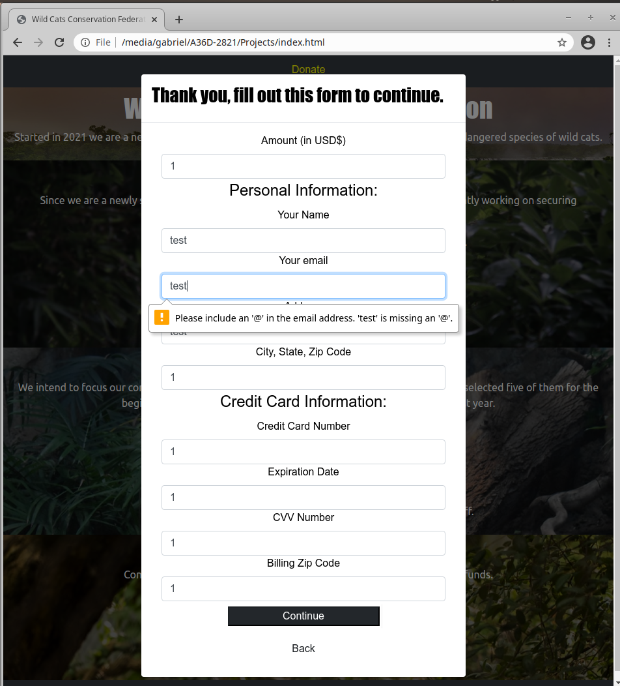
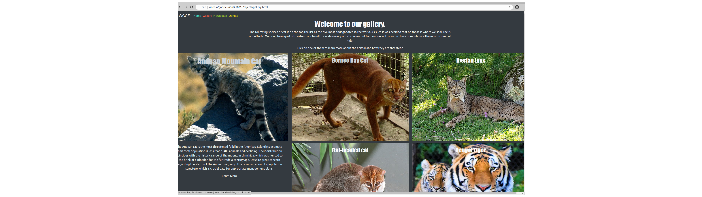

# Wild Cats Conservation Federation Website.

## Overview

I decided to make a charity website. For inspiration i though if i had a charity what would it be centered on? Well i really like big cats, like tiger and such. I remembered going to the zoo and watching them feed the lions, it was awsome. I would be a shame if there where to come a point in time where was no longer possible. In future i would like to go on saffari and when i do i would like there to be some lion and tigers there. As such i decided that the conservation of wild cat species would be the subject of my website project. 

## UX

This website is for anyone looking for a charity specificly targeting wild cat conservation efforts. I did not focus it on one particular species but on several, a misstake in hindsight. Durring the sourcing of information i found an article on the five most endangered cat species and decided to focus the website on them. 

The first and most important aspect of a charity is the donation page. Since we are trying to raise money for a cause i determined that this was the number one most important part. A big button that says donate on every page. I chose the color yellow for this element because i stands our and it was the most common color used for this purpose across several website.

At first i had different pages for all the button, if you clicked donate it would take you to a separate page. I had trouble populating these pages with information and it also caused alot of uncessesary bloat so i decided that making them modal elements would be better.

User stories: As a person looking for a suitable charity i want to get information on what type of work the organisation does. 

I also want a place to donate. If i decide to make a contribution to the organisation i want that process to be as clear and easy to understand as possible. 

I want to be able to recive updates on the organisations ongoing efforts. 

I want to be able to access information and to be able to make contact with the people behind the project easily. 

Link to wireframe.

## Features

### Existing Features

Feature one - Donation button/form. A place where one can make donations is available on every page and sits in the navigation bar at the top of the page. 

Feature two - Newsletter signup form. Same as the above, if a user finds themselves interessted in the project a button to signup to our newsletter. 

Feature three - Gallery. An easily expandable gallery is available to acces from the menu and proves insight on the different animals the organisation is targeting and some light information about them. The page also directs users to some more heavy reading they can do elsewhere on the internet. It just takes them to the wikipedia article for each species but i decided that this would be sufficent. 

Feature four. Contactt form. If one wished to get in touch with us they are provided with a form in the footer section on every page. Allows users to fill out a contact form.

Additional Feature. Expanding the gallery section to include additional information and having a video section. Also a section where perhaphs people can vote on different cat species they want us to work with, like an intergrated strawpol. 

For some/all of your features, you may choose to reference the specific project files that implement them, although this is entirely optional.

## Technologies used in this project

For this project i used VScode as my editor. 
https://code.visualstudio.com/. VScode is has wide functionally. I used a bootstrap extension to autogenerate the templates with a simple !bscn,although i found later on that the template did not pass the w3c validation. Still saved me from having to copy paste the scripts from their website. Link to extension: https://marketplace.visualstudio.com/items?itemName=eventyret.bootstrap-4-cdn-snippet

### Libraries/frameworks

**Bootstrap version 4.1.** https://www.getbootstrap.com. It provided a simple way to speed up development and made it easier to make the site look good across media platform. Also made it possible to have the submission forms as modals instead of them being their own separate pages.

**Jquery.** The project uses JQuery to simplify DOM manipulation. Bootstrap 4 also uses jquery for some of it's functionality. The extent of its use is limited but allow the form functionaly to work properly.

## Testing

**Donate form** Doesn't let you continue unitl you have filled out all the required fields. Although it does not connect to an external api that can process donations so for now it is just for show. 

If you dont fill it out correctly it will tell you as so: 

And if you fill out the form it will take you to a small confirmation page as so:

**Newsletter form** Same as the above. Takes you to a confirmation page if you fill it out, doesnt let you pass otherwise. 

 

And if you fill it out corretly it takes you here: 

**Contact form** Works the same as the other two. Doesn't let you pass until you fill out all the fields. 

And here is the page you will see after making a valid submission:

**Gallery**  

The gallery proves you with pictures of cats. If you click on one you will be presented with a couple of paragrafs on detailing threats facing them along with a button that takes you to their wikipedia article.

Look and feel across media platforms. The navbar changed based on your screen size i used a bootstrap class nav-bar-expand-xl for this as this required me to automate and not have to incorporate media queries in my css file. xl covered all cases from the smallest phone up to the largest tablet on the chrome devtool, the ipad pro. 

This look is retained across all the pages (since the code is the same).

Problems/bugs. I had alot of trouble making the gallery. I wanted images that would expand when you click on them. As seen here:   The card class i found difficult to work with. I could not get it to look the way i wanted and also have the cards resize on small screen. I went through many different looks as i experiented with bootstraps different card classes. Ultimately i had to accept i could not get it to look good across devices and still retain the functionaly that i wanted. 

Footer and header. I went though something similar here. Alhough this problem i could fix. I wanted the header to be fixed but with a fixed-top class it did not push the content below it. Fixed that by adding some top margin to the content below it. The footer was also a sticky at one point but i found that it served no other purpose then to take up space on the screen, was a little to much on smaller devices. 

Ultimately there are no actual bugs as of writing this. All the functionally works as it should.

## Deployment

I used Github Pages to deployt my site. There are no diffrences between versions. I use VScode debugging functionally to open a chrome instance to view it locally.

Credits
Content

The information where in most part taken from this article: 
 
https://news.mongabay.com/2017/09/the-worlds-5-most-endangered-wild-cats/

along with some information sources from the indivudal wikipedia article from each species of cat, links to all the articles:

https://en.wikipedia.org/wiki/Andean_mountain_cat
https://en.wikipedia.org/wiki/Bay_cat
https://en.wikipedia.org/wiki/Flat-headed_cat
https://en.wikipedia.org/wiki/Iberian_lynx
https://en.wikipedia.org/wiki/Bengal_tiger

## Media:

**Images** where mainly sourced from https://www.unsplash.com/ with a few from wikipedia.org (Cats on the gallery).

## Acknowledgements:

I was inspired mainly by this article 

https://news.mongabay.com/2017/09/the-worlds-5-most-endangered-wild-cats.

I had also recently seen the netflix documentary Tiger King. 

https://www.netflix.com/se-en/title/81115994.

